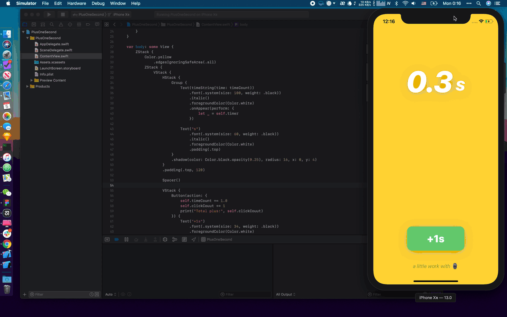

# C01 - 🕰 Plus One Second

Timer with a button to plus one second per click.



## Notes

### The Timer Logic

To refresh our interface every 0.1 second, we should use a timer and declare how should the interface works.

The `@State` recreates the interface every time the date is updated.

``` swift
@State var timeCount: Double = 0.0

var timer: Timer {
    Timer.scheduledTimer(withTimeInterval: 0.1, repeats: true) {timer in
        self.timeCount += 0.1
    }
}
```

### Time Formating

The timer should run like **0.1s**, so we must create a function to format the time.

``` swift
func timeString(time: Double) -> String {
    return String(format: "%.1f", time)
}
```

### Using the timer

Use `onAppear` to initialize the timer.

``` swift
Text(timeString(time: timeCount))
  .onAppear(perform: {
      let _ = self.timer
  })
```

## References

- [How To Make a Simple Countdown Timer with SwiftUI](https://medium.com/better-programming/make-a-simple-countdown-with-timer-and-swiftui-3ce355b54986)
