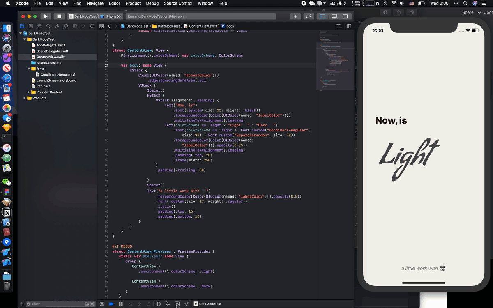

# C02 - 🔛 Dark Mode Test

Dark mode test with custom typeface display.



## Notes

### Custom Font

First, follow [this article](https://developer.apple.com/documentation/uikit/text_display_and_fonts/adding_a_custom_font_to_your_app "Adding a Custom Font to Your App | Apple Developer Documentation") from Apple to add the font file to your XCode project, and then register it with iOS.

Use the typeface like this:

``` swift
Text("foobar")
  .font(Font.custom("Condiment-Regular", size: 98))
```

### HEX Color to `UIColor`

`F3` in [hexadecimal](https://en.wikipedia.org/wiki/Hexadecimal "Hexadecimal - Wikipedia") equals `0.95` in [`Double`](https://en.wikipedia.org/wiki/Double-precision_floating-point_format "Double-precision floating-point format - Wikipedia").

Example: `#F3F1EC` in HEX is `UIColor(red:0.95, green:0.95, blue:0.93, alpha:1.0)` in Swift.

Tips:

Using a tool like [this](http://hex2rgba.devoth.com "HEX 2 RGBA Color Calculator | by @Devoth"), or Google *hex to rgba* to find a tool.

### Background Color
Use `ZStack` with color first show like a background.

``` swift
ZStack {
  Color.init(UIColor(red:0.95, green:0.95, blue:0.93, alpha:1.0))
    .edgesIgnoringSafeArea(.all)
}
```

`.edgesIgnoringSafeArea(.all)` means ignore [safe area](https://developer.apple.com/documentation/uikit/uiview/positioning_content_relative_to_the_safe_area "Positioning Content Relative to the Safe Area | Apple Developer Documentation").

### Dynamic Colors

Adding dynamic colors in `Assets.xcassets` is recommend, fast and works great. Follow [this article](https://developer.apple.com/documentation/appkit/supporting_dark_mode_in_your_interface "Supporting Dark Mode in Your Interface | Apple Developer Documentation") from Apple or [this article](https://www.fivestars.blog/code/ios-dark-mode-how-to.html "How To Adopt Dark Mode In Your iOS App 🌙 | Five Stars").

Steps:

1. Open `Assets.xcassets`
2. Right-click the blank area of assets catalog then select `New Color Set` to create a new color set
3. Select it then open Attribute Inspector (`⌘⌥4`), and set its appearance from `None` to `Any, Dark`
4. Select the appearance then define color you want. Set its input method from `Floating point (0.0–1.0)` to `8-bit Hexadecimal` in Attribute Inspector if you want use HEX like `#FFFFFF`.

> Use the Any Appearance variant to specify the color value to use on older systems that do not support Dark Mode.

### Changing in Different Appearance

I want to show "Light" in light appearance, and "Dark" in dark appearance.

Getting the `\.colorScheme` environment with: `@Environment(\.colorScheme) var colorScheme: ColorScheme`,  then use it: `Text(colorScheme  == .light ? "Light" : "Dark")`.

Full code:

``` swift
@Environment(\.colorScheme) var  colorScheme: ColorScheme

var body: some View {
  Text(colorScheme  == .light ? "Light " : "Dark ")
    .font(colorScheme == .light ?  Font.custom("Condiment-Regular", size: 98) : Font.custom("Superclarendon", size: 78))
}
```

## References

- [Adding a Custom Font to Your App](https://developer.apple.com/documentation/uikit/text_display_and_fonts/adding_a_custom_font_to_your_app)
- [Supporting Dark Mode on iOS 13](https://schiavo.me/2019/implementing-dark-mode/)
- [Dark mode on iOS preparations using asset catalog colors - SwiftLee](https://www.avanderlee.com/xcode/dark-mode-on-ios-preparations-using-asset-catalog-colors/)
- [How To Adopt Dark Mode In Your iOS App 🌙](https://www.fivestars.blog/code/ios-dark-mode-how-to.html)
