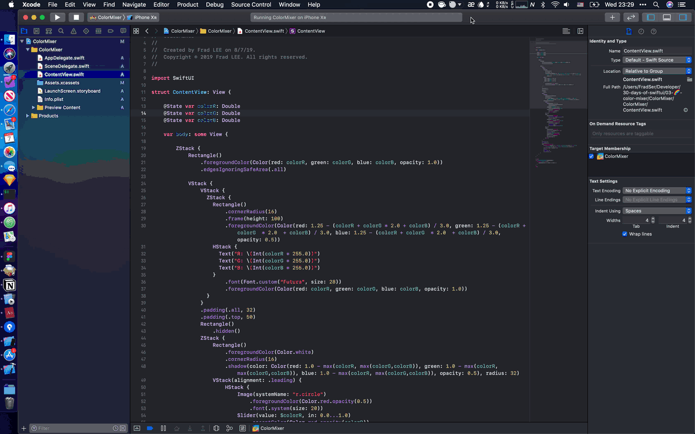

# C03 - 🌈 Color Mixer

Color mixer with slider and SF Symbol.



## Notes

### Slider

Read [this article](https://www.notion.so/C03-Color-Mixer-d5737a7af30e47d7b738351a42dcb55a#6868e7b84be04ecf99afdd0c6d9bdfe4) from Apple first. Most important is `init(value:in:onEditingChanged:)`, to use it the code like `Slider(value: $colorR, in: 0.0...1.0)`.

Read [this article](https://developer.apple.com/documentation/swift/range) from Apple if you don't understand `0.0...1.0` like me.

If you follow some tutorials like `Slider(value: $colorR, from: 0.0, through: 1.0)` you will get a `'init(value:from:through:onEditingChanged:)' is deprecated: replaced by 'init(value:in:onEditingChanged:)'` warning, replace it.

A simple slider code is like:

``` swift
HStack {
  Text("0").color(.red)
  Slider(value: $colorR, in: 0.0...1.0)
  Text("255").color(.red)
}
```

Then you must define a init data in `SceneDelegate.swift`. I want to get a random number in 0.0–1.0 every time the app startup, here is the code:

``` swift
window.rootViewController = UIHostingController(rootView: ContentView(colorR: Double.random(in: 0..<1), colorG: Double.random(in: 0..<1), colorB: Double.random(in: 0..<1)))
}
```
In my case I also want to change the color of track when I drag the thumb, use `.accentColor()`. Like:

``` swift
Slider(value: $colorR, in: 0.0...1.0)
  .accentColor(Color.red.opacity(colorR))
```

### SF Symbol

The most excited feature in iOS 13. [This article](https://developer.apple.com/design/human-interface-guidelines/sf-symbols/overview/) from Apple and [This article](https://codeburst.io/playing-with-swiftui-part-1-61e763f68e38) is useful.

One of the sliders finally like:

``` swift
HStack {
  Image(systemName: "r.circle") // minimum image
    .foregroundColor(Color.red.opacity(0.5)) // color
    .font(.system(size: 20)) // SF Symbol likes font
  Slider(value: $colorR, in: 0.0...1.0) // track
    .accentColor(Color.red.opacity(colorR)) // color
  Image(systemName: "r.circle.fill") // maximum image
    .foregroundColor(Color.red) // color
    .font(.system(size: 25)) // SF Symbol likes font
}.padding()
```

### Linking to [RGBA](https://en.wikipedia.org/wiki/RGBA_color_space) Changing

The background color and shadow of some views will change with color mixer. One of the choices is find the max in colors (`max(colorR, max(colorG,colorB))`) and create a black and white color. Like:

``` swift
Text("a little work with 🌈")
  .foregroundColor(Color(red: 1.25 - max(colorR, max(colorG,colorB)), green: 1.25 - max(colorR, max(colorG,colorB)), blue: 1.25 - max(colorR, max(colorG,colorB)), opacity: 0.75))
  .font(.system(size: 17, weight: .regular))
  .italic()
  .padding(.top, 16)
  .padding(.bottom, 16)
```

## References

- [SwiftUI: Getting Started](https://www.raywenderlich.com/3715234-swiftui-getting-started)
- [Is there function to convert UIColor to Hue Saturation Brightness?](https://stackoverflow.com/questions/10071756/is-there-function-to-convert-uicolor-to-hue-saturation-brightness)
- [SF Symbols - SF Symbols - Human Interface Guidelines - Apple Developer](https://developer.apple.com/design/human-interface-guidelines/sf-symbols/overview/)
- [Playing with SwiftUI Part-1](https://codeburst.io/playing-with-swiftui-part-1-61e763f68e38)
- [UISlider - UIKit | Apple Developer Documentation](https://developer.apple.com/documentation/uikit/uislider)
- [Range - Swift Standard Library | Apple Developer Documentation](https://developer.apple.com/documentation/swift/range)
