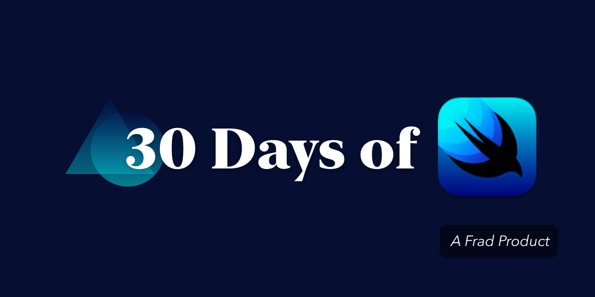

# 30 Days of SwiftUI 

## Challenges

### [C01 - 🕰 Plus One Second](./01-🕰-plus-one-second)

 

*Timer with a button to plus one second per click.*

### [C02 - 🔛 Dark Mode Test](./02-🔛-dark-mode-test)

 

*Dark mode test with custom typeface display.*

### [C03 - 🌈 Color Mixer](./03-🌈-color-mixer)

 

*Color mixer with slider and SF Symbol.*

### [C04 - 🔠 Typeface Comparison](./04-🔠-typeface-comparison)

 

*A 3D rotate typeface comparison.*

### [C05 - 🐱 Cat Scene](./05-🐱-cat-scene)

 

*Yet an other SceneKit copycat.*

### [C06 - 🗣 Text Field Animation](./06-🗣-text-field-animation)

 

*A text field animation inspired by [a shot](https://dribbble.com/shots/4948429-TextField-Interaction-Experiment).*

### [C07 - 💬 Google Translate Demo](./07-💬-google-translate-demo)

 

*A real-world Google translate demo.*

### [C08 - 🎴 Z Index Cards](./08-🎴-z-index-cards)

 

*Cards with z index animation.*

### [C09 - 🍀 Breathing Animation](./09-🍀-breathing-animation)

 

*Apple Watch Breathing like animation.*

### [C10 - 🛌 Clock Bedtime Schedule](./10-🛌-clock-bedtime-schedule)

 

*A part iOS Clock bedtime schedule like gestures.*

### [C11 - 📄 SF Symbols Previewer](./11-📄-sf-symbols-previewer)

 

*A SF symbols previewer with weight changing.*

### [C12 - 🚕 Side Menu Interaction](./12-🚕-side-menu-interaction)

 

*Side menu interaction with custom symbols.*

### [C13 - 🅱️ LiZhi Zhuangbi](./13-🅱️-lizhi-zhuangbi)

 

*A real-world random lyrics of [#LiZhi](https://twitter.com/hashtag/LiZhi) under MVVM facilitates.*

### [C14 - 🎫 Lottie Showcase](./14-🎫-lottie-showcase)

 

*SwiftUI [Lottie](https://airbnb.io/lottie/#/) showcase.*

## Authors

* **Frad Lee** - *Initial work* - [@FradSer](https://twitter.com/fradser)

See also the list of [contributors](https://github.com/FradSer/30-days-of-swiftui/contributors) who participated in this project.

## License

This project is licensed under the MIT License - see the [LICENSE](LICENSE) file for details
