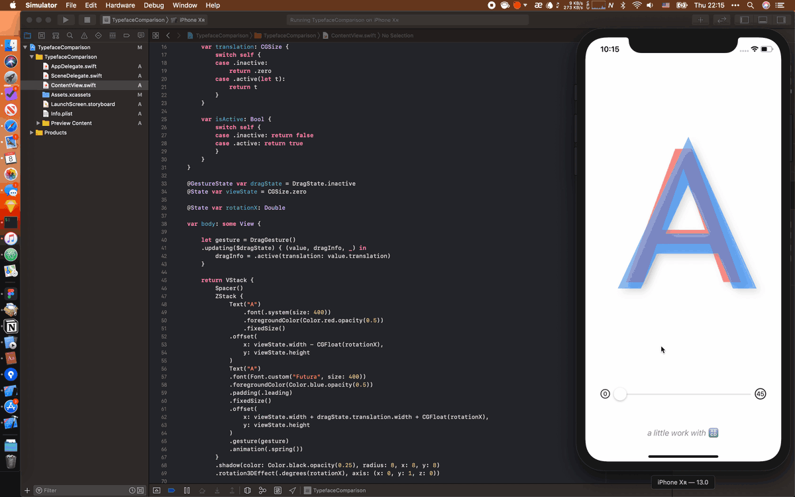

# C04 - 🔠 Typeface Comparison

A 3D rotate typeface comparison.



## Notes

### Fixed Size

Use `.fixedSize` to set the width and height of view automatic. Code like:

``` swift
Text("Typeface")
  .font(Font.custom("Futura", size: 120))
  .foregroundColor(Color.blue.opacity(0.5))
  .multilineTextAlignment(.leading)
  .padding(.leading)
  .fixedSize()
```

### Composing View Gestures

Emmm...This is a long story. [This article](https://developer.apple.com/documentation/swiftui/gestures/composing_swiftui_gestures) by Apple is really the one you must read it. If you want know more, [this article](https://mecid.github.io/2019/07/10/gestures-in-swiftui/) will help you.

But all above two articles is sample of `[LongPressGesture](https://www.google.com/search?client=safari&rls=en&q=LongPressGestures&ie=UTF-8&oe=UTF-8)` which mens:

> A gesture that ends once a long-press event sequence has been recognized.

It's not a common gesture but very useful to understand how `.gesture()` works. In this case, we use `[DragGesture](https://developer.apple.com/documentation/swiftui/draggesture)`.

#### Define the Drag Gesture

First you should define the drag gesture include `inactive` state and `active` state with the amount of translation while dragging. Code Like:

``` swift
enum DragState {
  case inactive
  case active(translation: CGSize)

  var translation: CGSize {
    switch self {
    case .inactive:
      return .zero
    case .active(let t):
      return t
    }
  }

  var isActive: Bool {
    switch self {
    case .inactive: return false
    case .active: return true
    }
  }
}
```

#### Defining Gesture State

Then define gesture state parameter for the gesture. Create a gesture which named `dragGesture` with`.updating()` method to update the property. Use `.offset()` method to the `x` and `y` properties. Full code:

``` swift
@GestureState var dragState = DragState.inactive
@State var viewState = CGSize.zero

var body: some View {

  let dragGesture = DragGesture()
  	.updating($dragState) { (value, dragInfo, _) in
		dragInfo = .active(translation: value.translation)
	}

	return Text("A")
		.offset(
			x: viewState.width + dragState.translation.width,
			y: viewState.height
		)
		.gesture(dragGesture)
}
```

### 3D Rotation

In this case we use a slider to control the rotation of text. You can learn more about slider in my last challenge. Something different in this case a `step` declaration is necessary, like `Slider(value: $rotationX, in: 0.0...45.0, step: 1.0)` .

`.rotation3DEffect()` modifier lets us rotate views in 3D, very easy.

``` swift
@State var rotationX: Double

var body: some View {
	Text("Placeholder")
		.rotation3DEffect(.degrees(rotationX), axis: (x: 0, y: 1, z: 0))
	Slider(value: $rotationX, in: 0.0...45.0, step: 1.0)
}
```

### Animations

Use `.animation()` modifier like `.animation(.spring())`, looks pretty.

## References

- [How to rotate a view ](https://www.hackingwithswift.com/quick-start/swiftui/how-to-rotate-a-view)
- [SwiftUI: State and Animations](https://www.youtube.com/watch?v=egG7orMW9-o)
- [SwiftUI Gestures](https://nsscreencast.com/episodes/400-swiftui-gestures)
- [Gestures in SwiftUI](https://mecid.github.io/2019/07/10/gestures-in-swiftui/)
- [Composing SwiftUI Gestures](https://developer.apple.com/documentation/swiftui/gestures/composing_swiftui_gestures)
- [SwiftUI Gestures, Blend Modes and 3D Transform](https://www.youtube.com/watch?v=js1qFgJS67Q)
